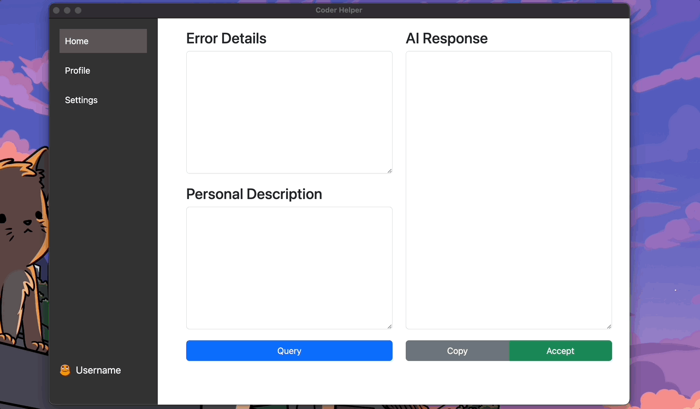

# coder_helper
### Example1



### Prompt

```


这是当前 Electron 项目的文件夹
"""
├── README.md
├── css
│   └── styles.css
├── html
│   ├── home.html
│   ├── profile.html
│   └── settings.html
├── images
│   └── avatar.png
├── index.html
├── js
│   └── renderer.js
├── lint
│   └── lint.sh
├── main.js
├── package-lock.json
└── package.json
"""

我现在希望修改 home.html，作为一个基于 openai 3.5 api 的智能 Debug 页面。
该页面分左右两行，左边这行有上下两个框，分别用于：

- 上面的：具体的填写报错信息
- 下面的：添加一些个人的描述

右边这行主要是用来展示由 API 返回的内容，在展示框下面有一个 Accept 按钮，如果你对这个答案满意就按下这个按钮，程序将会把这次问答转化成一个 Markdown 文件存储在某个位置，用来后续的搜索和复习。

请你基于我的需求在 home.html 以及 css/ js/ 文件中做出对应的修改，并且使用 Python 作为 API 的后端实现，保留一个 query 函数留给我进行实现。

下面请从 html js css 不同角度进行实现。
```