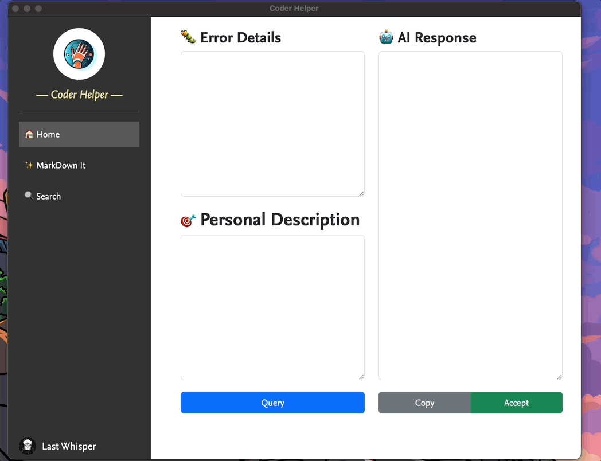

# Coder Helper

## 0. Show



## 1. How to use.

```
Shell1
$ python app.py
Shell2
$ npm start
```

## 2. Examples

### Example 🏠Home-Query


### Example 🔍Search


## 3. Prompt：How to develop it quick.

```
这是当前 Electron 项目的文件夹
"""
├── README.md
├── app.py
├── assets
│   └── image-20230701005821535.png
├── css
│   └── styles.css
├── data
├── examples
│   └── example1.gif
├── fonts
│   ├── NexusSans-Bold.otf
│   ├── NexusSans-Italic.otf
│   └── NexusSans-Regular.otf
├── html
│   ├── home.html
│   ├── markdownIt.html
│   └── settings.html
├── images
│   ├── avatar.png
│   └── logo.png
├── index.html
├── js
│   └── renderer.js
├── lint
│   └── lint.sh
├── main.js
├── package-lock.json
└── package.json
"""

我现在希望修改 html，作为一个XXXX。

"""
描述信息
"""

下面请从 html js css 不同角度进行实现，请你考虑到 Electron 项目的特性给出回复。
```

